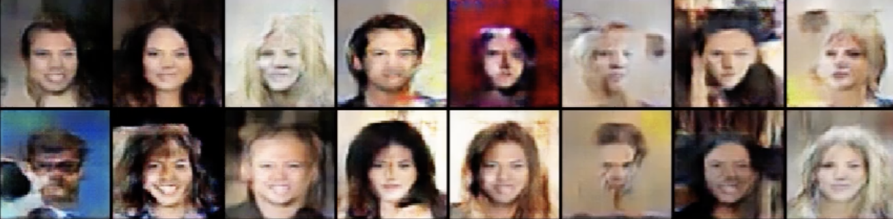

# DCGAN
## Summary
It is a side project in 2023. The project is a Computer Vision topic. The languages and relevent packages are **Python - Pytorch**. The repo built the DCGAN to train the famous MNIST dataset. 
## Data
Pytorch MNIST datasets. The MNIST database (Modified National Institute of Standards and Technology database) is a large database of handwritten digits that is commonly used for training various image processing systems. 
## Model
The model includes generator and discriminator model. The generator utilizes transposed convolutional layer to upsample the feature size from 1*100 noise vector to 64*64 images. The disciminator is a convolutional network to classify the fake/real image.
## Loss
Discrimantor $D$ wants to seperate the real($x$)/fake($z$) images as much as possible, whereas generator $G$ wants to put the real($x$)/fake($z$) images as close as possible.
$$D_Loss = max\Bigl(log(D(x)) + log(1 - D(G(z))\Bigl)$$
$$G_Loss = min\Bigl(log(1 - D(G(z))\Bigl) = max\Bigl(log(D(G(z))\Bigl)$$
## Result
<figure>
  
</figure>

## Reference
https://github.com/aladdinpersson/Machine-Learning-Collection
